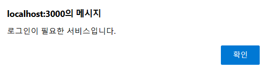

# 🏥 BodyTalk
   
### 프로젝트 소개
사용자로부터 입력받은 증상을 바탕으로 예상되는 질병을 알려주는 서비스

### 프로젝트 목적
코로나 19와 같은 전염병으로 병원에 가서 진단받기 곤란할 때, 몸이 아프고 컨디션이 안 좋아서 병원에 가서 진료를 받기 쉽지않을 때 
병을 방치할 경우 처음 증상을 인지했을 때 보다 몸 상태가 악화되기 때문에 **자가진단 할 수 있는 서비스의 필요성을 느끼게 되어 개발**

### 개발기간
2023.02.06 - 2023.07.05

### 멤버구성
정지원 - Back-end, Front-end, AI
 
이성준 - Front-end

  

# 📚 기술스택

   
### Languages
       

### Technologies
   

### Collaboration Tool
 

  

      
# 📌 주요기능

   

      펼쳐보기 👈
   

   
## Web
### 회원가입 및 로그인

   
   
   
   회원가입을 하게 되면 기본정보를 입력받게 됩니다.  
   성별에 따라서 증상을 진단받을 때, 다른결과가 나옵니다.
   
    
   
   
   
   구글, 카카오, 네이버 로그인을 제공합니다.  
   로그인을 하게 되면 최근 진단결과, 증상 일기등의 기능을 사용할 수 있습니다.

     

### 메인 화면 (진단 결과  순위)

   
   

   사용자들이 많이 진단받는 진단명들의 순위를 보여줍니다.

     

### 증상 진단

   
   

   증상을 입력하면 Kobert 모델이 분석 후 유사도가 가장 높은 질병과 질병의 간략한 정보, 관련 병원을 추천합니다. 
   로그인시 진료받은 병명을 잊어 다시 진료 받는 상황이 발생하지 않도록 진료 내역이 자동으로 저장됩니다.

     

### 병원 찾기

    
   
   
   진료 과목을 선택한 뒤 내 주변 병원찾기 버튼을 클릭하면 내 위치를 기반으로 가까운 병원을 찾아줍니다.

     

   

   진료 과목을 선택한 뒤 지역명으로 병원찾기 버튼을 클릭하면 주소를 입력받는 창이 나타납니다. 
   주소를 입력하면 주소와  가까운 병원을 찾아줍니다.

     

   

   나타난 병원들을 선택하게 되면 지도의 핀 색이 바뀌고 선택한 병원으로 이동합니다.

     

### 증상 일기

   증상 일기는 증상이 나타날 때 마다 증상을 일기처럼 기록함으로써 증상을 추적할수 있도록합니다. 
   증상을 추적함으로써 **병원에서 진단을 받을 때 의사에게 제공하여 진단의 정확성을 높일 수 있습니다.**
   
   

   증상 일기는 로그인이 필요한 서비스 입니다. 
   로그인을 하지않고 diary를 클릭하면 위와 같은 메세지가 노출됩니다.

     

   

   달력에서 날짜를 선택해 증상 일기를 작성할 수 있습니다.

     

   

   일기는 증상에 맞는 태그를 5개까지 선택해서 작성할 수 있습니다.

     

   

   작성된 일기는 다시 볼 수 있고 수정할 수 있습니다.

     

   

   증상 진단과 작성한 일기의 태그를 통해 만들어진 증상 통계와 부위 별 통계를 확인할 수 있습니다.

     

### 마이페이지

   
   

   내정보를 확인하고 수정할 수 있습니다. 
   내정보의 성별에 따라 증상진단 서비스에서 진단받을 수 있는 질병이 달라집니다.

     

   
   
   최근 진단받은 진료기록을 한 눈에 볼 수 있습니다. 
   진료기록을 선택하면 진단받은 내용을 상세하게 볼 수 있습니다.

  

# 🗒 회의록 - Notion

   

      펼쳐보기 👈
   

## 온라인 미팅

   

   
